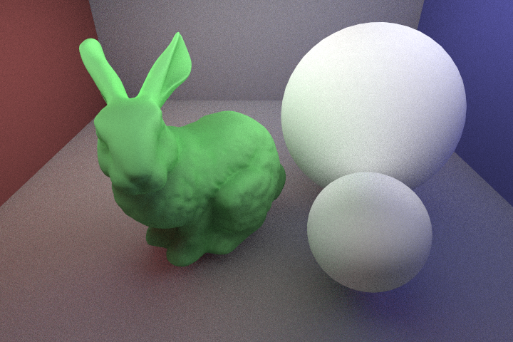

# Traced
A simple `C++17` Monte-Carlo path-tracer. 

## Features
* Live rendering in window
* Multi-threaded
* Supports `.obj` 3D-meshes
* Basic material system
* Positionable camera 
* Acceleration structures: Bounding Volume Hierarchies

## Dependencies
* [SDL](https://www.libsdl.org/)
* [graphics-math](https://github.com/jvmnielsen/graphics-math) (a small mathematics library I wrote for this project--it is automatically included by CMake). 

I recommend installing dependencies, i.e. SDL, via a package manager such as [vcpkg](https://github.com/Microsoft/vcpkg), and then invoking CMake with `-DCMAKE_TOOLCHAIN_FILE=[path to vcpkg]/scripts/buildsystems/vcpkg.cmake`, pointing it to the relevant tool-chain file. 

## Building the Project
The project can be built and run using [CMake](https://cmake.org/). The scene is set up in `main.cpp`. A window shows the progress of the render, that when closed saves the image as `out.bmp`.  

The project uses the namespace `tr`. 